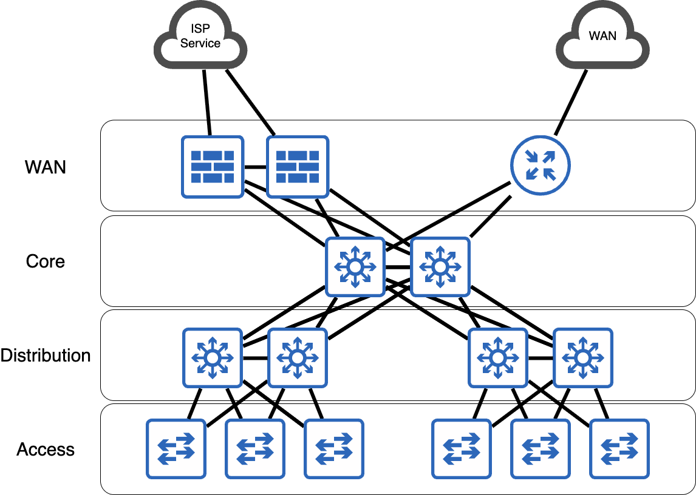

# LAN Network Design

## Architecture

This is a very contrived example of a LAN. In this LAN design, We have a bog-standard Core/Distribution/Access layers that provide connectivity. The overall design is shown in the image below:

### Routing Design

The routing for the LAN uses multi-area OSPF. The core devices are only in area zero and are not ABRs. The distribution layer switches are ABRs and each pair of distribution switches own their own OSPF area. The access switches are running OSPF as well, and are performing routed access. To reduce load on access layer switches, each LAN POD uses OSPF NSSA.

### IP addressing Design

Wait, people actually plan this stuff?

## Issues

WAN devices could be moved onto their own POD with their own area to make the diagram look cooler.
