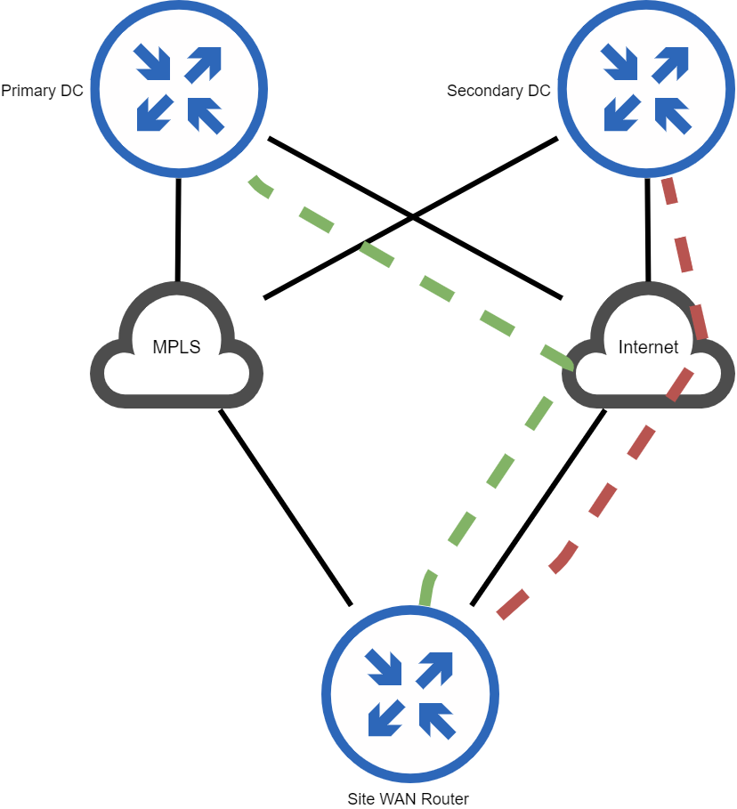

# WAN Network Design

## Architecture

This is a very contrived example of a WAN. In this WAN design, each site has a single WAN router that handles all of the WAN routing for that site. Each site router terminates a private full-mesh IPVPN MPLS circuit and two standard GRE tunnels to each DC. The overall design is shown in the image below:

## Routing Design

The routing for the WAN is provided by eBGP. Each site has its own ASN and has at least 3 peers.

* Peer with PE router
* Peer with Primary DC Router over GRE tunnel
* Peer with Secondary DC Router over GRE tunnel

Path selection obviously follows the BGP rules, but in this WAN design, ASPath pre-pending is used heavily to modify which path BGP selects. On each router there are two route-maps that perform the ASPath prepending, `backup-primary` and `backup-secondary`. Typically, the `backup-secondary` route-map prepends the site's ASN 8 times, and the `backup-primary` route-map prepends the site's ASN 7 times. These route-maps are applied to the peers on the site-router so that the routes are prepended as they are advertised out. For example, for the site router, the peers would look like this:

* MPLS Peer — No route-map applied.
* Primary DC GRE Tunnel Peer — `backup-primary` route-map applied.
* Secondary DC GRE Tunnel Peer — `backup-secondary` route-map applied.

The end result of these route maps is that the MPLS is used as the primary path, Primary DC is the secondary path, and Secondary DC is selected as the tertiary path.
