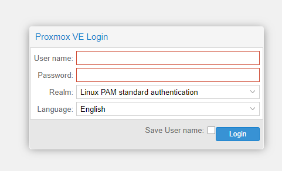

# Overview

From Wikipedia, the free encyclopedia

Proxmox Virtual Environment (Proxmox VE; short PVE) is an open-source server virtualization management platform. It is a Debian-based Linux distribution with a modified Ubuntu LTS kernel and allows deployment and management of virtual machines and containers. Proxmox VE includes a web console and command-line tools, and provides a REST API for third-party tools. Two types of virtualization are supported: container-based with LXC (starting from version 4.0 replacing OpenVZ used in version up to 3.4, included), and full virtualization with KVM. It comes with a bare-metal installer and includes a web-based management interface.

## Logging into Proxmox

Here is what the login page for proxmox looks like:

Fascinating!
